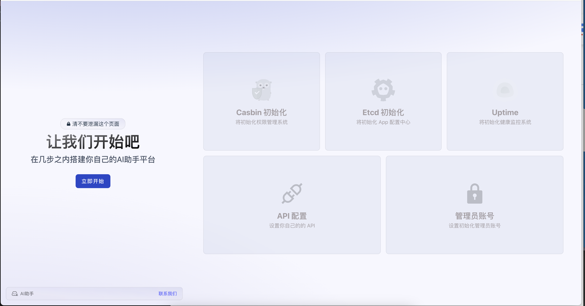

# AI 助手自部署版本

Looking for English README? [Click here](./README_EN.md)

基于 Docker 的快速环境配置和搭建，你可以快速为你的企业或者团队搭建一个 AI 助手系统，掌握所有的数据和信息！

## 使用说明

### 1. 在 Zeabur 上部署

只需要点击下面的按钮，即可在 Zeabur 上部署 AI 助手系统。

[](https://zeabur.com/templates/3HCGYO?referralCode=jctaoo)

点击上面的按钮后，进入如下界面:


点击右上角的 **Deploy** 按钮

出现如下弹框，填写自己想要的域名, 如图所示，分为主域名和管理后台域名:


> 注意不要选择上海地区，除非你有已经经过 IPC 备案的域名。且在该区域部署的服务将无法访问 OpenAI，Google 以及 Anthropic 的服务。

等待部署完成后，访问自己先前设置的主域名，根据步骤进行配置，如图所示:



点击 **立即开始** 按钮, 将为你自动配置。当进行到如下步骤时:


如果你有 **Token**， 点击 **输入 Token** 按钮并输入你的 Token，否则点击 **稍后配置** 按钮，你可以在后台管理系统中配置。

最后按照引导配置管理员账号和密码，请牢记他们，稍后可以用于登录你的 App 和管理后台。

恭喜完成🎉，接下来访问主域名即可访问 App 官网，点击右上角的打开 Web 应用，即可访问你自己部署的 AI 助手系统。

### 2. 使用 docker compose

使用 docker compose 部署，只需要将该仓库 clone 到本地，然后执行以下命令即可，然后根据需要修改 run.env 或者直接使用默认配置。

```bash
git clone https://github.com/enhanceai/self-deploy.git
cd self-deploy
docker compose --env-file run.env up -d
```

最后，访问 http://localhost/ 即可访问部署的 AI 助手官网，访问 http://localhost:8080/ 即可访问部署的 AI 助手后台管理系统。
